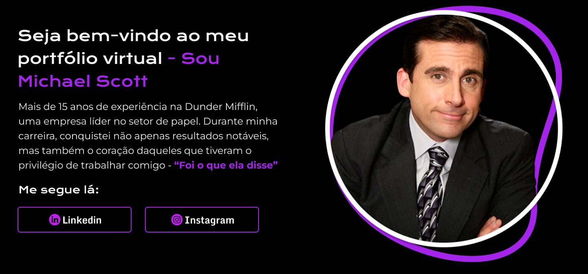

# Portfolio Michael Scott




> Projeto para você começar a impressionar nas vagas de emprego, aprenda montar um portifólio para se apresentar adequadamente aos recrutadores.

## 💼 Principais Ferramentas


## 💻 Pré-requisitos

Antes de começar, verifique se você atendeu aos seguintes requisitos:

* Disciplina ⌛
* Força de  Vontade 💪
* Visua Studio Code instalado 🖥️

## 🚀 Clonando a base do portfolio Michael Scott

Para Clonar a base do projeto você pode ver o video abaixo ou seguir o seguinte processo:

Video Youtube:
```
<Link>
```

Dentro do repositorio:
```
<comando_de_instalação>
```


## ☕ Usando <nome_do_projeto>

Para usar <nome_do_projeto>, siga estas etapas:

```
<exemplo_de_uso>
```

Adicione comandos de execução e exemplos que você acha que os usuários acharão úteis. Fornece uma referência de opções para pontos de bônus!

## 🤝 Colaboradores

Para mais conteudos incriveis que vão ti fazer evoluir siga o canal da Wtudway e seus fundadores:

<table>
  <tr>
    <td align="center">
      <a href="https://www.youtube.com/@stud-way">
        <br>
        <sub>
          <b>Studway</b>
        </sub>
      </a>
    </td>
    <td align="center">
      <a href="https://www.youtube.com/@Ale-Neves">
        <br>
        <sub>
          <b>Alexandre Neves(Z)</b>
        </sub>
      </a>
    </td>
    <td align="center">
      <a href="https://www.youtube.com/@ViniciusMesquini">
        <br>
        <sub>
          <b>Vinicius Mesquini</b>
        </sub>
      </a>
    </td>
  </tr>
</table>